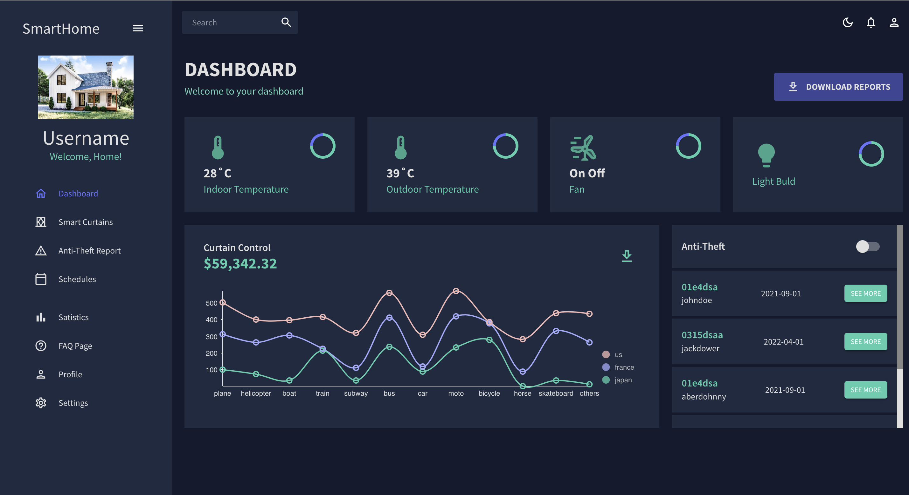

# Smart Home Website Project
This project is a smart home management system designed to allow users to control and monitor IoT devices within a home environment. The web application provides a user-friendly interface for managing devices such as lights, temperature sensors, humidity sensors, doors, and window shades
# Website address
In progress

# Technologies used to build this website
1. Front-end: <b>ReactJS</b>
2. Back-end: <b>Node.js</b>
3. Database: <b>MongoDB</b>
4. Hosting:

# Development Status:
Under development.
# Setup and Installation
Prerequisites

Node.js and npm must be installed on your computer. Download and install them from [Node.js official website.]([url](https://nodejs.org/en))
Getting Started

Clone the project from GitHub or download the source code.
Open a terminal in Visual Studio Code and navigate to the project directory.

Run the following commands:

1. npm install         # Install necessary npm packages
2. npm run build       # Build the application
3. npm run start       # Start the application

# Dashboard

